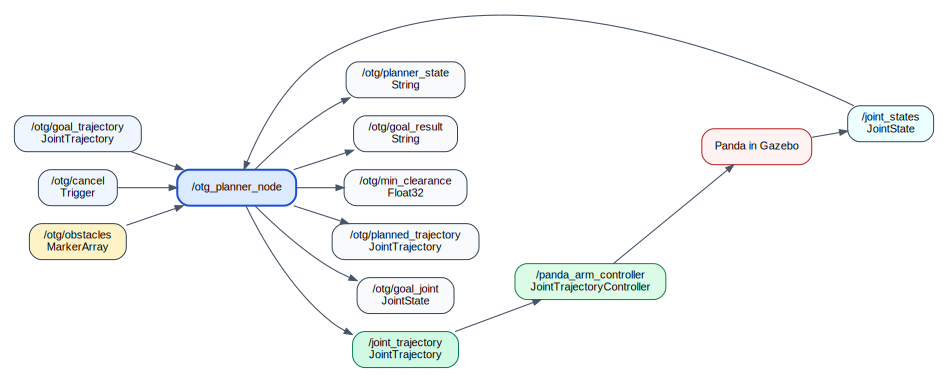
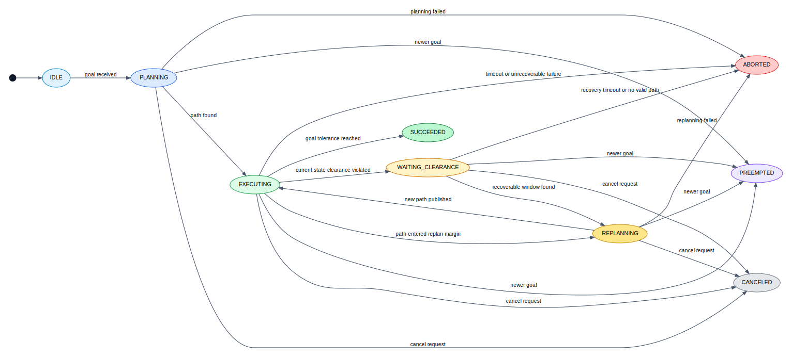

# otg_planner Architecture

  <a href="./ARCHITECTURE.md">简体中文</a> | <a href="./ARCHITECTURE.en.md">English</a>

## 1. Scope

`otg_planner` is now a joint-space planning and execution stack for the Franka Panda in `ROS 2 Humble + Gazebo Sim`.

It is no longer just a fixed A/B motion demo. The current stack provides:

- external joint-space goal input
- collision-aware global path planning
- Ruckig-based online local execution
- dynamic obstacle monitoring
- hold / wait / replan recovery behavior

The system still plans in joint space. It is not a Cartesian planner and it does not depend on MoveIt for its runtime planning loop.

## 2. Main Components

### 2.1 Launch and Simulation

File:

- `otg_planner/launch/simulation.launch.py`

Responsibilities:

- start Gazebo Sim
- publish `/clock`
- spawn the Panda robot
- start `robot_state_publisher`
- activate `joint_state_broadcaster`
- activate `panda_arm_controller`
- start the planner node
- optionally start the demo client
- optionally start the obstacle scenario publisher

### 2.2 Planner Node

File:

- `otg_planner/planner_server.py`

Node:

- `/otg_planner_node`

Responsibilities:

- receive external goals from `/otg/goal_trajectory`
- normalize goal waypoints into Panda joint order
- read current motion state from `/joint_states`
- plan a collision-aware joint path
- run a Ruckig step every control cycle
- stream single-point commands to `/joint_trajectory`
- monitor obstacle clearance
- switch between execution, waiting, and replanning states

### 2.3 Planning Core

File:

- `otg_planner/planning_core.py`

Responsibilities:

- Panda joint limits and dynamic bounds
- simplified forward kinematics
- sphere-chain robot approximation
- capsule obstacle approximation
- clearance computation
- collision validity checking
- `RRT-Connect` planning
- shortcutting
- path resampling

### 2.4 ROS Utilities

File:

- `otg_planner/ros_utils.py`

Responsibilities:

- reorder joint arrays to Panda joint order
- extract ordered joint positions and velocities from `JointState`
- convert markers into capsules
- convert planned paths into preview trajectories
- build single-point command trajectories
- choose lookahead targets on the active path

### 2.5 Obstacle Scenario Publisher

File:

- `otg_planner/obstacle_scenario_node.py`

Node:

- `/obstacle_scenario_publisher`

Responsibilities:

- publish `MarkerArray` obstacles on `/otg/obstacles`
- support `static`, `moving`, and `mixed` scenarios
- clear obstacles after scenario completion

### 2.6 Demo Client

File:

- `otg_planner/demo_client_node.py`

Node:

- `/otg_demo_client_node`

Responsibilities:

- publish alternating A/B joint goals
- wait until the planner goal subscription exists
- monitor progress through `/joint_states`

### 2.7 Compatibility Entry Point

File:

- `otg_planner/ruckig_node.py`

Purpose:

- compatibility wrapper that forwards to `planner_server.main`

## 3. Runtime Dataflow

Diagram sources: `docs/images/runtime_dataflow.mmd`, `docs/images/runtime_dataflow.dot`

## 4. Internal Planning and Execution Logic

### 4.1 Global Geometry Layer

For each requested goal:

1. reorder goal joints into Panda joint order
2. get the latest joint positions
3. plan from current state to each waypoint with `plan_joint_path`
4. shortcut the path
5. resample the path to bounded joint steps

This layer answers:

- what collision-free joint path should be followed

It does not decide the final online timing at runtime.

### 4.2 Local Optimal Execution Layer

The old behavior published a full preview trajectory and relied on static timing.

The current behavior is different:

1. read current position, velocity, and estimated acceleration from `/joint_states`
2. choose a lookahead point on the active path
3. feed the current state and target point into `Ruckig`
4. publish a single-point trajectory command for the next control horizon
5. repeat every control cycle

This means the executed motion is always based on the real robot state, not a blind open-loop timing assumption.

At each cycle, the local step is time-optimal with respect to the current state, target, and the configured velocity / acceleration / jerk bounds.

## 5. Collision Model

### 5.1 Robot Model

The Panda is approximated as a chain of spheres placed along the simplified kinematic chain.

Purpose:

- fast clearance checks
- conservative collision testing
- planner-side geometric validity tests

### 5.2 Obstacle Model

Incoming markers are converted into capsules.

Supported marker types:

- `CYLINDER`
- `SPHERE`

Each obstacle capsule is then checked against each robot sphere to compute:

- state clearance
- path clearance

## 6. Recovery Strategy

The runtime safety logic now has three layers:

### 6.1 Normal Execution

- follow the active geometric path
- stream Ruckig-generated single-point commands

### 6.2 Early Replanning

If the remaining path enters a replan margin, the planner does not wait for a hard failure. It switches to replanning early.

Purpose:

- avoid replanning only after the robot has already entered a bad state

### 6.3 Hold Until a Recoverable Window Exists

If the current robot state is already inside a clearance violation:

1. switch to `WAITING_CLEARANCE`
2. publish hold commands
3. keep monitoring clearance
4. attempt replanning only when the current state becomes recoverable
5. return to `EXECUTING` after a new path is found

This is the main change that made the dynamic-obstacle behavior more stable than the previous immediate-abort policy.

## 7. Planner State Machine

Diagram sources: `docs/images/planner_state_machine.mmd`, `docs/images/planner_state_machine.dot`

## 8. Topics and Interfaces

### Inputs

- `/otg/goal_trajectory` (`trajectory_msgs/msg/JointTrajectory`)
- `/otg/cancel` (`std_srvs/srv/Trigger`)
- `/joint_states` (`sensor_msgs/msg/JointState`)
- `/otg/obstacles` (`visualization_msgs/msg/MarkerArray`)

### Outputs

- `/joint_trajectory` (`trajectory_msgs/msg/JointTrajectory`)
- `/otg/planned_trajectory` (`trajectory_msgs/msg/JointTrajectory`)
- `/otg/planner_state` (`std_msgs/msg/String`)
- `/otg/goal_result` (`std_msgs/msg/String`)
- `/otg/min_clearance` (`std_msgs/msg/Float32`)
- `/otg/goal_joint` (`sensor_msgs/msg/JointState`)

### Controller Mapping

At launch, `/joint_trajectory` is remapped to:

- `/panda_arm_controller/joint_trajectory`

## 9. Key Files

- `otg_planner/planner_server.py`
- `otg_planner/planning_core.py`
- `otg_planner/ros_utils.py`
- `otg_planner/demo_client_node.py`
- `otg_planner/obstacle_scenario_node.py`
- `otg_planner/launch/simulation.launch.py`
- `otg_planner/urdf/panda.urdf.xacro`

## 10. What Has Been Verified

Verified in the workspace:

- package builds successfully
- tests pass
- Gazebo launches end-to-end
- controller chain is active
- external goals can be planned and executed
- obstacle publishing is visible to the planner
- dynamic obstacles trigger `WAITING_CLEARANCE` and `REPLANNING`
- the controller receives streamed single-point commands during execution

## 11. Current Limitations

The current strategy is much more stable than the old demo, but it still does not guarantee eventual success for arbitrary moving obstacles.

In particular:

- the planner works in joint space only
- collision checking is approximate
- the system does not predict obstacle time windows
- a continuously oscillating obstacle can still force repeated replans
- there is no dedicated retreat-to-safe-region behavior yet

## 12. Recommended Next Step

The next strongest improvement would be to add a true safe retreat policy:

- when `WAITING_CLEARANCE` persists, move to a verified safe posture set
- replan from that safe region instead of holding the current pose forever

That would turn the current "hold and retry" recovery policy into a stronger "retreat, wait, then recover" policy.
